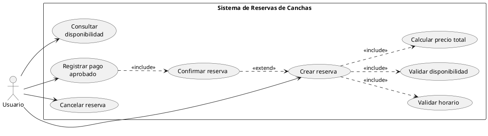
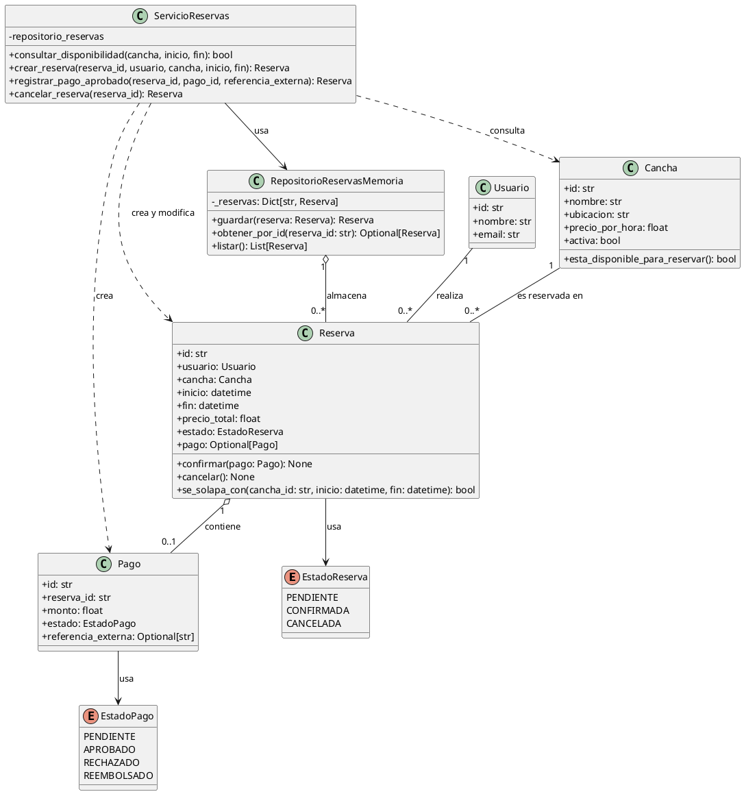
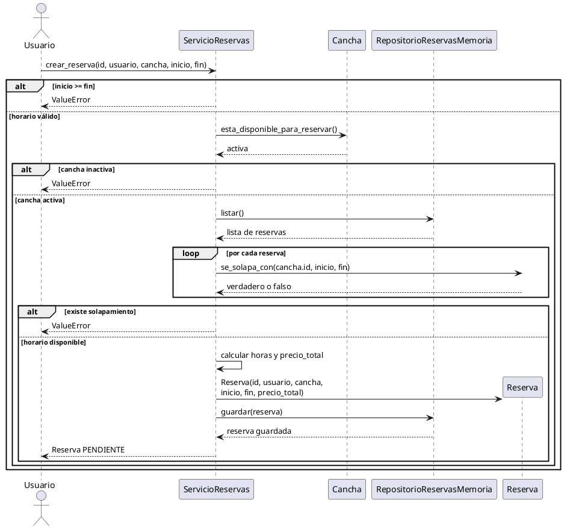
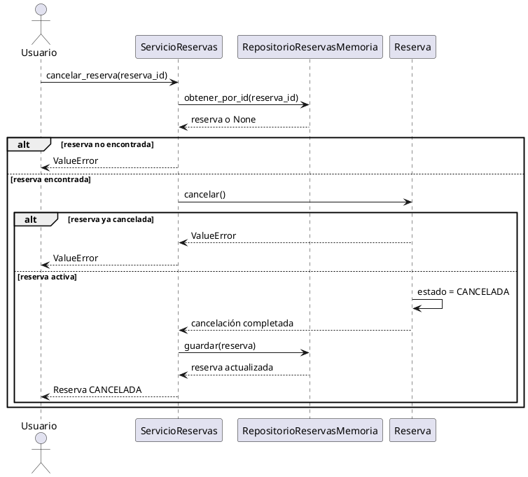

# Documento de Diseño UML
## Sistema de Reservas de Canchas Deportivas

## 1. Descripción general del sistema

El sistema permite gestionar reservas de canchas deportivas de forma simple. La versión funcional mínima incluye tres casos de uso principales:

1. Consultar disponibilidad.
2. Crear una reserva.
3. Cancelar una reserva.

También se incluye el registro de un pago aprobado, el cual permite confirmar una reserva que inicialmente fue creada con estado pendiente.

El diseño UML se mantiene relacionado con el código implementado. Las clases, operaciones y relaciones descritas en este documento corresponden principalmente a los archivos `models.py`, `services.py` y `repositories.py`.

---

## 2. Alcance de la versión mínima

La aplicación permite:

- Verificar que una cancha esté activa.
- Consultar si una cancha está disponible en un horario.
- Evitar reservas confirmadas que se solapen.
- Calcular el precio según el número de horas.
- Crear una reserva en estado `PENDIENTE`.
- Registrar un pago aprobado.
- Confirmar una reserva después del pago.
- Cancelar una reserva.
- Guardar y consultar reservas mediante un repositorio en memoria.

No se incluyen todavía:

- Interfaz gráfica o aplicación web.
- Base de datos permanente.
- Autenticación de usuarios.
- Envío de notificaciones.
- Integración con una pasarela de pagos real.
- Reembolsos automáticos.

---

## 3. Enfoque 4+1

### 3.1 Vista lógica

La vista lógica representa los elementos principales del sistema y sus responsabilidades.

Las entidades centrales son:

- `Usuario`: representa a la persona que realiza una reserva.
- `Cancha`: representa una cancha deportiva que puede estar activa o inactiva.
- `Reserva`: conserva el usuario, la cancha, el horario, el precio y el estado.
- `Pago`: conserva la información del pago relacionado con una reserva.

También se utilizan:

- `EstadoReserva`: enumeración de estados de una reserva.
- `EstadoPago`: enumeración de estados de un pago.
- `ServicioReservas`: coordina los casos de uso.
- `RepositorioReservasMemoria`: almacena temporalmente las reservas.

### 3.2 Vista de desarrollo

El proyecto está organizado en los siguientes módulos:

```text
src/
└── reservas/
    ├── __init__.py
    ├── models.py
    ├── repositories.py
    └── services.py

tests/
└── test_reservas.py

docs/
├── diseno_uml.md
├── informe_malos_olores.md
└── evidencias/
```

Responsabilidades:

- `models.py`: entidades, enumeraciones y comportamiento del dominio.
- `services.py`: operaciones de disponibilidad, creación, pago y cancelación.
- `repositories.py`: almacenamiento de reservas en memoria.
- `tests/`: pruebas unitarias ejecutadas con `pytest`.
- `docs/`: documentación UML y evidencias del proyecto.

### 3.3 Vista de procesos

El sistema trabaja de forma síncrona y local.

El flujo principal es:

1. El usuario solicita una reserva.
2. `ServicioReservas` verifica que el horario sea válido.
3. El servicio consulta si la cancha está disponible.
4. El sistema calcula el precio total.
5. Se crea una reserva pendiente.
6. La reserva se guarda en memoria.
7. Cuando se registra un pago aprobado, la reserva cambia a confirmada.

Para cancelar:

1. El usuario proporciona el identificador de la reserva.
2. El servicio busca la reserva.
3. La reserva cambia su estado a cancelada.
4. El repositorio guarda el estado actualizado.

### 3.4 Vista física

La versión actual se ejecuta como una aplicación Python local dentro de GitHub Codespaces o en un computador que tenga Python instalado.

```text
Usuario
   |
   v
Aplicación Python
   |
   +-- ServicioReservas
   |
   +-- RepositorioReservasMemoria
           |
           v
     Diccionario en memoria
```

No existe todavía una base de datos externa ni un servidor web. Cuando termina la ejecución, los datos almacenados en memoria se pierden.

### 3.5 Vista de escenarios

Los escenarios principales son:

- Escenario 1: consultar la disponibilidad de una cancha.
- Escenario 2: crear una reserva pendiente.
- Escenario 3: registrar un pago aprobado y confirmar una reserva.
- Escenario 4: cancelar una reserva.
- Escenario alternativo: rechazar una reserva si existe un solapamiento.
- Escenario alternativo: mostrar un error cuando una reserva no existe.

---

## 4. Diagrama de casos de uso



### Explicación

- `Crear reserva` incluye validar el horario, validar disponibilidad y calcular el precio.
- `Registrar pago aprobado` incluye confirmar la reserva.
- `Confirmar reserva` extiende el proceso de creación, porque una reserva puede existir primero como pendiente y confirmarse posteriormente.
- `Cancelar reserva` es un caso independiente que modifica el estado de una reserva existente.

---

## 5. Diagrama de clases



### Relaciones y multiplicidades

- Un `Usuario` puede realizar cero o muchas reservas.
- Cada `Reserva` pertenece a un solo usuario.
- Una `Cancha` puede aparecer en cero o muchas reservas.
- Cada `Reserva` corresponde a una sola cancha.
- Una `Reserva` puede no tener pago o tener un solo pago.
- `ServicioReservas` utiliza `RepositorioReservasMemoria`.
- El repositorio puede almacenar cero o muchas reservas.

---

## 6. Diagrama de secuencia: crear reserva



---

## 7. Diagrama de secuencia: cancelar reserva



---

## 8. Patrón de diseño aplicado

### Patrón Repository

El patrón principal aplicado es **Repository**, representado por la clase `RepositorioReservasMemoria`.

Su responsabilidad es centralizar las operaciones de almacenamiento:

- Guardar una reserva.
- Buscar una reserva por identificador.
- Listar todas las reservas.

`ServicioReservas` no administra directamente el diccionario de datos. En su lugar, utiliza los métodos del repositorio.

### Beneficios

- Separa la lógica de aplicación del almacenamiento.
- Evita que `ServicioReservas` manipule directamente la estructura interna de datos.
- Facilita las pruebas unitarias.
- Permite reemplazar posteriormente el repositorio en memoria por una base de datos.
- Reduce el impacto de cambios en la persistencia.

En la versión actual, el patrón se aplica de manera básica porque solo existe una implementación concreta en memoria. Una evolución futura podría introducir una interfaz o clase abstracta para el repositorio.

---

## 9. Trazabilidad entre diseño y código

| Elemento del diseño | Ubicación en el código |
|---|---|
| `Usuario` | `src/reservas/models.py` |
| `Cancha` | `src/reservas/models.py` |
| `Reserva` | `src/reservas/models.py` |
| `Pago` | `src/reservas/models.py` |
| `EstadoReserva` | `src/reservas/models.py` |
| `EstadoPago` | `src/reservas/models.py` |
| `ServicioReservas` | `src/reservas/services.py` |
| `RepositorioReservasMemoria` | `src/reservas/repositories.py` |
| Pruebas unitarias | `tests/test_reservas.py` |

---

## 10. Correspondencia entre casos de uso y métodos

| Caso de uso | Método principal |
|---|---|
| Consultar disponibilidad | `ServicioReservas.consultar_disponibilidad()` |
| Crear reserva | `ServicioReservas.crear_reserva()` |
| Registrar pago aprobado | `ServicioReservas.registrar_pago_aprobado()` |
| Confirmar reserva | `Reserva.confirmar()` |
| Cancelar reserva | `ServicioReservas.cancelar_reserva()` |
| Validar solapamiento | `Reserva.se_solapa_con()` |
| Guardar reserva | `RepositorioReservasMemoria.guardar()` |
| Buscar reserva | `RepositorioReservasMemoria.obtener_por_id()` |

---

## 11. Decisiones de diseño

### Uso de entidades con `dataclass`

Las clases `Usuario`, `Cancha`, `Pago` y `Reserva` utilizan `dataclass` para reducir código repetitivo y mantener una estructura clara.

### Reglas dentro del dominio

Las operaciones `confirmar()`, `cancelar()` y `se_solapa_con()` se encuentran dentro de `Reserva`, porque modifican o consultan directamente su estado.

### Servicio de aplicación

`ServicioReservas` coordina las diferentes entidades y el repositorio. Allí se implementan los pasos completos de los casos de uso.

### Repositorio en memoria

La persistencia se realiza con un diccionario porque el objetivo de esta fase es demostrar diseño orientado a objetos, UML, pruebas y refactorización sin agregar la complejidad de una base de datos.

---

## 12. Conclusión

El diseño presenta una separación básica entre el modelo del dominio, los casos de uso y el almacenamiento. Los diagramas representan la implementación actual y permiten observar cómo colaboran `Usuario`, `Cancha`, `Reserva`, `Pago`, `ServicioReservas` y `RepositorioReservasMemoria`.

La solución es pequeña, pero permite aplicar posteriormente refactorizaciones en métodos, clases y objetos, datos y condicionales, manteniendo las pruebas unitarias como mecanismo de seguridad.
